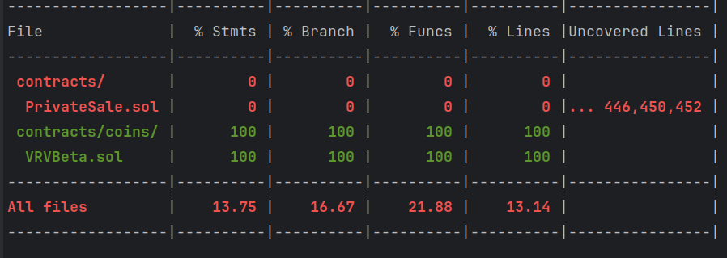
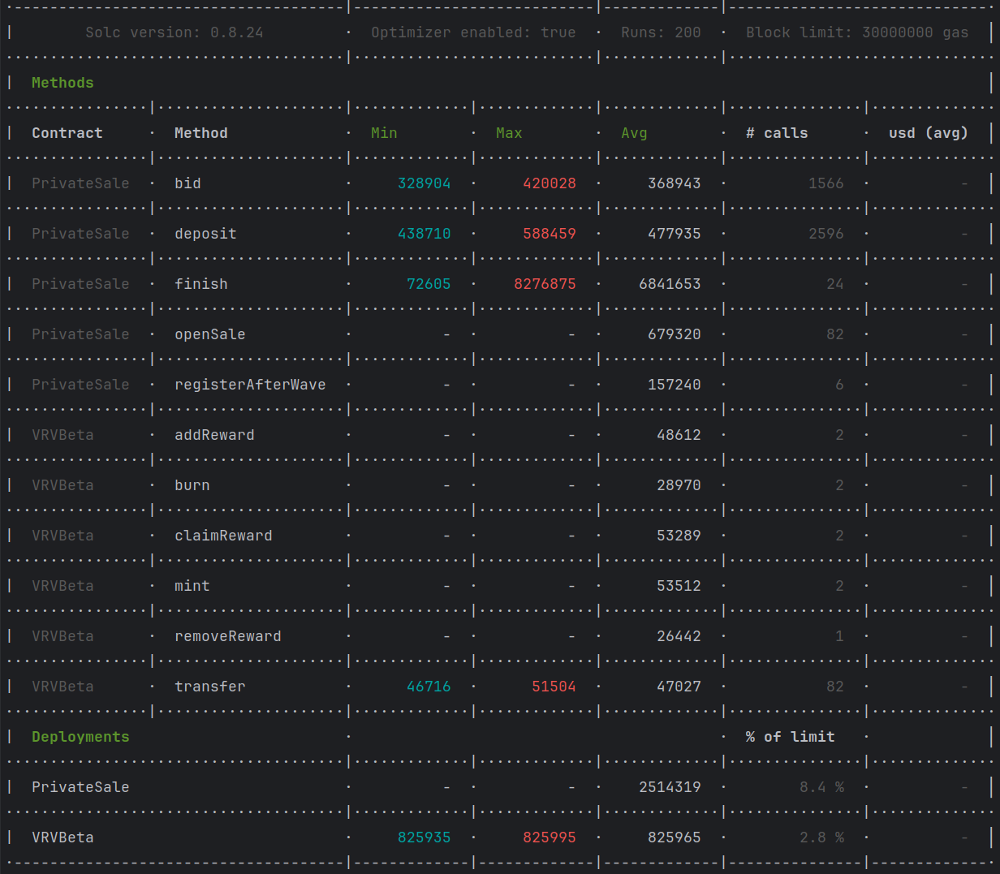

# VRV Смарт контракты

## Coverage



## Gas



## Команды

### Запуск тестов

```shell
npx hardhat test
```

### Запуск тестов (с расчетом расхода газа)

```shell
REPORT_GAS=true npx hardhat test
```

### Запуск локальной ноды

```shell
npx hardhat node
```

### Деплой на локальный контур (только VRV контракт)

После запуска локальной ноды

```shell
npx hardhat ignition deploy ./ignition/modules/OnlyVervCoin.ts --network localhost
```

## Описание контрактов (23.04.2024)

### VRV

- Name - `Verv-Beta`
- Symbol - `VRV`
- Decimals - `18`
- Зависимости - `ERC20`, `ERC20Burnable`, `Ownable`

Основные тезисы:
- Обычный `ERC20` контракт
- Основное отличие в том, что владелец чеканить может только для другого кошелька.
- Возможность назначать награды пользователям. Которые они получают сами. Под капотом происходит чеканка. Ограничить 
  по времени. Не востребованную награду можно удалить 


### PrivateSale

- Name - `Verv-Private-Sale`
- Symbol - `VPRIVATE`
- Decimals - `0`
- Зависимости - `Ownable`, `EIP712`

Основные тезисы:
- Контракт `EIP712`
- Домен `EIP712` контракта - `VERVPRIVATESALE`. Версия - `1`
- Перед стартом продаж нужно инициализировать
- Принимает депозиты от пользователей
- Каждый депозит подписывается владельцем контракта
- 10 волн для депозитов
- Устанавливается лимит по количеству токенов на каждую из волн. Остаток не перетекает на следующую
- Есть несколько условий прекращения приема депозитов.
  - Завершился прием по hardCap
  - Не достаточно лимита в текущей волне. Попробуйте купить меньше
- При условии набора hardCap прием депозитов завершается
- Добавляем метод, который завершает продажи, возвращает всем все либо переводит все бабки на баланс
  кошелька который указан в методе

TODO: