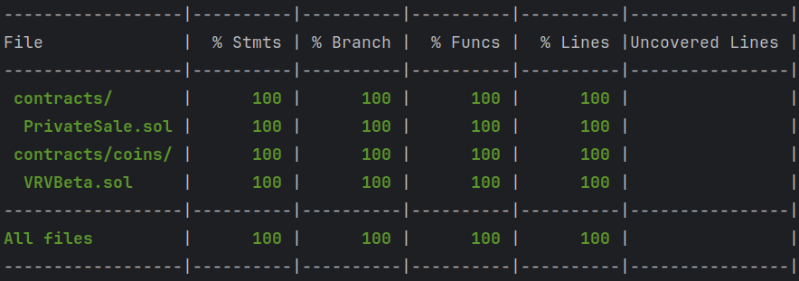

# VRV Смарт контракты

## Coverage



## Gas


## Команды

### Запуск тестов

```shell
npx hardhat test
```

### Запуск тестов (с расчетом расхода газа)

```shell
REPORT_GAS=true npx hardhat test
```

### Запуск локальной ноды

```shell
npx hardhat node
```

### Деплой на локальный контур (только VRV контракт)

После запуска локальной ноды

```shell
npx hardhat ignition deploy ./ignition/modules/OnlyVervCoin.ts --network localhost
```

## Описание контрактов (23.04.2024)

### VRV

- Name - `Verv-Beta`
- Symbol - `VRV`
- Decimals - `18`
- Зависимости - `ERC20`, `ERC20Burnable`, `Ownable`

Основные тезисы:
- Обычный `ERC20` контракт
- Основное отличие в том, что владелец чеканить может только для другого кошелька.
- Возможность назначать награды пользователям. Которые они получают сами. Под капотом происходит чеканка. Ограничить 
  по времени. Не востребованную награду можно удалить 

### PrivateSale

- Зависимости - `Ownable`, `EIP712`

Основные тезисы:
- Контракт `EIP712`
- Домен `EIP712` контракта - `VERVPRIVATESALE`. Версия - `1`
- Перед стартом продаж нужно инициализировать
- Принимает ставки от пользователей
- Принимает депозиты от пользователей
- Каждая ставка подписывается владельцем контракта
- Каждый депозит подписывается владельцем контракта
- 10 волн для ставок/депозитов
- Устанавливается лимит по количеству токенов на каждую из волн. Остаток не перетекает на следующую
- Есть Режим продажи после всех волн. куда все оставшиеся лимиты сливаются
- Перед депозитом нужно сделать ставку
- Можно отправить депозит минуя ставку
- Есть несколько условий прекращения приема депозитов.
  - Завершился прием по hardCap
  - Не достаточно лимита в текущей волне. Попробуйте купить меньше
- При условии набора hardCap прием депозитов завершается
- Есть Дата после которой продажи автоматически завершаются
- Добавляем метод, который возвращает всем если не набрали softCap или переводит все на указанный адрес в случае 
  набора softCap
- Деньги за ставки не возвращаем


## Взаимодействие с контрактами

### VRV

Есть все методы ERC20
[https://docs.openzeppelin.com/contracts/5.x/api/token/erc20#ERC20](https://docs.openzeppelin.com/contracts/5.x/api/token/erc20#ERC20)

Помимо этих методов есть другие методы

#### Deploy

```solidity
  // initSupply - Чеканим сразу количество токенов
  // _rewardsAt - Дата после которой нельзя взаимодействовать в методами наград
  constructor(uint256 initSupply, uint _rewardsAt);
```

#### Чеканка

```solidity

  // Отчеканить для адреса количество токенов. Только владелец контракта
  function mint(address to, uint256 amount) public onlyOwner;
```

#### Награды

```solidity

  // Разрешить wallet отчеканить amount токенов. Только владелец контракта
  function addReward(address wallet, uint256 amount) external onlyOwner;

  // Удалить разрешение wallet отчеканить. Только владелец контракта
  function removeReward(address wallet) external onlyOwner;

  // Проверить сколько награды доступно
  function hasReward() view external returns (uint256);
  
  // Получить доступную награду
  function claimReward() external;
```
 
